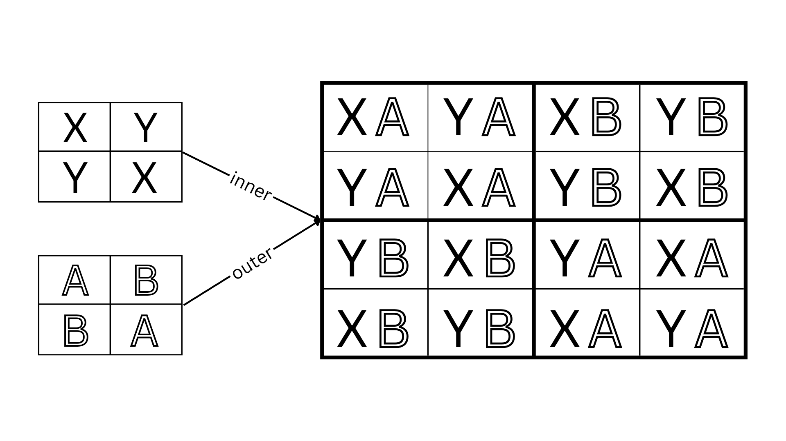
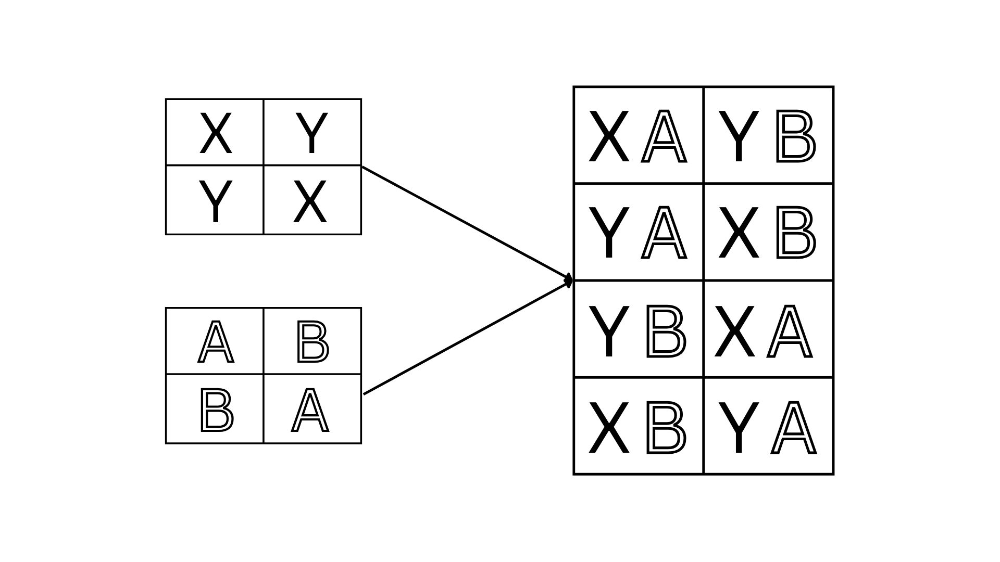

# PLanet
Welcome to PLanet's documentation! PLanet is a tool to help researchers author and analyze experimental designs.

# Constructs 
## Experiment Variable
An Experiment Variable is an independent variable the experimenter wants to use in an experiment. The experiment variables included in an experiment determine the conditions a unit sees. For example, treatment is an Experiment Variable with two conditions: drug or placebo. 

```python
Variable(name, options=[])
```
Creates an experimental variable. 

Parameters:

 - `name: str` -- name of the variable. 
 - `options: str[]` -- list of possible discrete assignment values of the variable. 


## Design
A design consists of every possible experimental plan a unit can get assigned
to, and the method of assigning these experimental plans to units. Experimental
designs describe the method of assigning conditions to units in an experiment. 

```python
Design()
```
Creates an experimental design object. 


## Operations
### BS
Adds a between subjects variable to the design. Adding a between-subjects
variable implies the assignment value to the between-subjects variable is the
same across all trials within a participant. 

```python
( 
    Design()
    .between_subjects(variable)
)
```

Parameters:

 - `variable: ExperimentVariable` -- an experiment variable. 


### Example
```python
treatment = Variable("treatment", options=["drug", "placebo"])

design = (
    Design()
    .between_subjects(treatment)
)
```
Creates a design with exactly one between-subjects variable, treatment. 

### WS
Adds a within subjects variable to the design. Adding a within subjects implies that assigment value to the within-subjects variable is the different for every trial in each experiment plan. 

```python
( 
    Design()
    .within_subjects(variable)
)
```

Parameters:

 - `variable: ExperimentVariable` -- an experiment variable. 


### Example
```python
treatment = Variable("treatment", options=["drug", "placebo"])

design = (
    Design()
    .within_subjects(treatment)
)
```
Creates a design with exactly one between-subjects variable, treatment. 

### CB
Counterbalances the specified variables, meaning we observe each variable value
an equal number of times in each position across all plans. 
Then input variable must already be specified in the
design as either within or between subjects.

```python
( 
    Design()
    .within_subjects(variable)
    .counterbalance(variable)
)
```
Parameters:

 - `variable: ExperimentVariable` -- an experiment variable. 


### Example
```python
treatment = Variable("treatment", options=["drug", "placebo"])

design = (
    Design()
    .within_subjects(treatment)
    .counterbalance(treatment)
)
```
Creates a design with treatment as a within-subjects with counterbalanced
conditions, treatment. The result of this program is a fully-counterbalanced
design with two possible experiment plans: $drug \rightarrow placebo$ and $placebo \rightarrow drug$.

### limit_plans
Limits the number of unique plans in the design. Limit plans set a maximum limit
on the number of assigned orders in an experimental design. 

```python
( 
    Design()
    .limit_plans(n)
)
```

Parameters:

 - `n: int` -- the exact number of plans in the design. 

Returns: A `Design` object


### Example
```python
treatment = Variable("treatment", options=["drug", "drug2", "placebo"])

design = (
    Design()
    .within_subjects(treatment)
    .counterbalance(treatment)
    .limit_plans(len(treatment))
)
```

The result is a counterbalanced, within-subjects design with three plans.
Because there are three assignment values of the treatment variable, each
treatment condition appears exactly once in each position.
If we do not limit the number of
plans, there are six possible orders, resulting in a fully-counterbalanced
design. 

### num_trials
Sets the number of trials for each plan in the design. 

```python
( 
    Design()
    .num_trials(n)
)
```

Parameters:

 - `n: int` -- the exact number of trials in each experimental plan. 


### Example
```python
treatment = Variable("treatment", options=["drug", "drug2", "placebo"])

design = (
    Design()
    .within_subjects(treatment)
    .counterbalance(treatment)
    .num_trials(2)
)
```

### order
Sets a fixed order of conditions. 
Requires that all conditions of a variable are specified in the order at least
once. 

```python
( 
    Design()
    .order(variable, ordering)
)
```

Parameters:
 - `variabe: ExperimentVariable` -- an experiment variable. 
  - `ordering: []str` -- list of conditions.

### Example
```python
treatment = Variable("treatment", options=["a", "b"])

design = (
    Design()
    .within_subjects(treatment)
    .order(variable, ["b", "a"])
)
```

This results in a design with exactly one order ($a \rightarrow b$) 

## Composing Designs
### nest
Composes orders of two designs as one design with a nesting strategy. Nesting ensures
that every condition of each order in the *inner* design is nested within each
trial of the *outer* design. 



```python
nest(inner=design1, outer=design2)
```
Parameters:

- `outer: Design` -- a design. 
-  `inner: Design` -- a design. 

### Example
```python

treatment = ExperimentVariable( 
    name = "treatment",
    options = ["drug", "placebo"]
)
task = ExperimentVariable(
    name = "task",
    options = ["run", "walk"]
)

treatment_des = (
    Design()
        .within_subjects(treatment)
        .counterbalance(treatment)
)

task_des = (
    Design()
        .within_subjects(task)
        .counterbalance(task)
)

des = nest(inner=treatment_des, outer=task_des)
```

### cross
Composes orders of two designs into one design with a crossing strategy. Crossing ensures
that each order in the first design is overlaid with each order of the second
design. `cross` requires that each design has the same number of trials per
participant. 


```python
cross(design1, design2)
```



Parameters:

- `design1: Design` -- a design 
-  `design2: Design` -- a design


### Example
```python

treatment = ExperimentVariable( 
    name = "treatment",
    options = ["drug", "placebo"]
)
task = ExperimentVariable(
    name = "task",
    options = ["run", "walk"]
)

treatment_des = (
    Design()
        .within_subjects(treatment)
        .counterbalance(treatment)
)

task_des = (
    Design()
        .within_subjects(task)
        .counterbalance(task)
)

des = cross(treatment_des, task_des)
```

### multifact
Combines every condition of all sub-variables to create a new variable, where
the conditions are the combined conditions of its sub-variables. 

```python
multifact(variables[])
```

Parameters:

- `variables: ExperimentVariable[]` -- a list of experiment variables


### Example
```python
treatment = Variable("treatment", options=["drug", "placebo"])
task = Variable("task", options=["run", "walk"])

multi_fact_variable = multifact([treatment, task])
```

The result is a new variable, treatment-task. The possible conditions are the
combined conditions from each variable (e.g., drug-run, placebo-run, drug-walk,
placebo-walk). 

